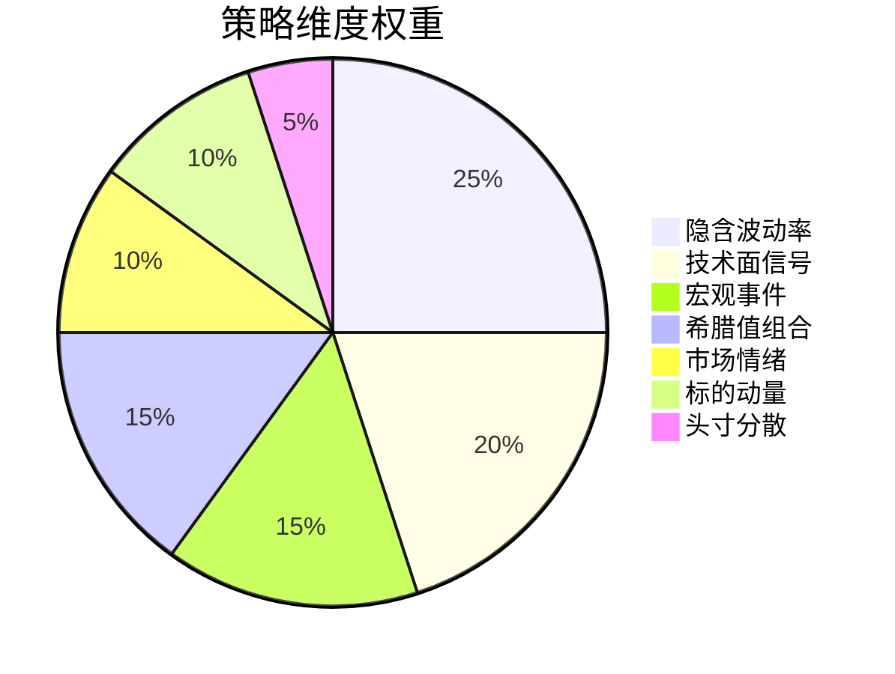
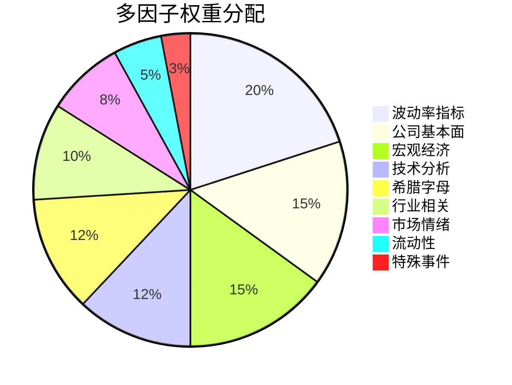
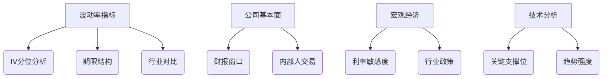
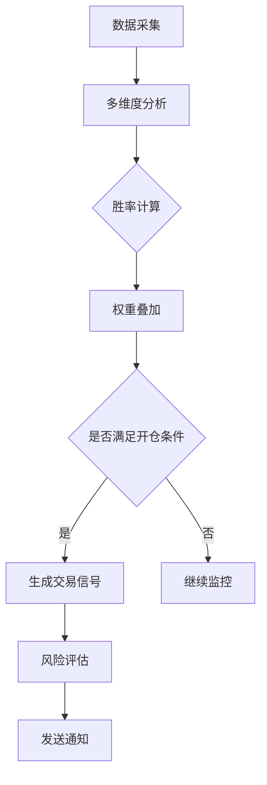
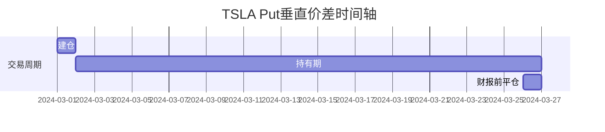
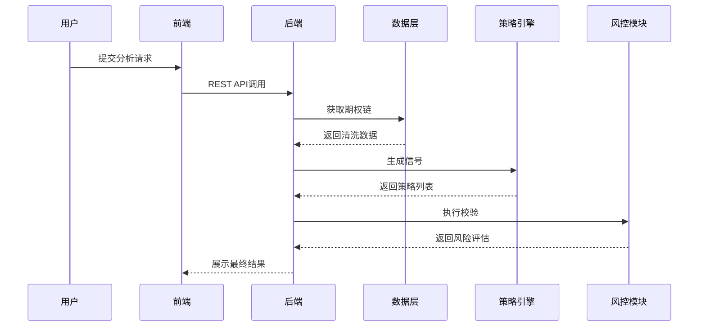

# 智能期权交易系统产品需求文档

## 1. 产品愿景
为期权交易者提供智能化的策略生成与风险管理工具，通过量化分析降低决策门槛，提升交易胜率。


## 2. 目标用户
| 用户类型         | 需求场景                     | 使用频率 |
|------------------|------------------------------|----------|
| 个人投资者       | 寻找高概率交易机会           | 每日     |
| 量化交易员       | 策略回测与参数优化           | 每周     |
| 投资顾问         | 为客户提供交易建议           | 按需     |

## 3. 核心功能

### 3.1 多维度策略分析引擎

#### 3.1.1 策略维度权重分配


#### 3.1.2 维度详细指标

1. **隐含波动率(IV)分析 (25%)**
   - IV百分位计算（1年历史数据）
     * IV > 70%分位：胜率权重 +15%
     * IV < 30%分位：胜率权重 -10%
   - IV与历史波动率(HV)对比
     * IV显著高于HV：胜率权重 +10%
   - 操作时机
     * 财报季前
     * VIX > 25的市场恐慌期

2. **技术面分析 (20%)**
   - 支撑/阻力位判断
     * 价格距支撑位 < 3%：权重 +12%
   - 技术指标信号
     * RSI < 30且底背离：权重 +8%
   - 成交量特征
     * 期权到期日前密集成交区：权重 +5%

3. **宏观事件分析 (15%)**
   - 重要事件识别
     * CPI/非农/议息会议
   - IV变化规律
     * 事件前IV上升 > 10%：权重 +10%
   - 财报季影响
     * SPY成分股财报期：权重 +5%

4. **希腊值组合管理 (15%)**
   - Theta/Delta优化
     * Theta ≥ 0.5 × Delta：权重 +9%
   - Gamma风险控制
     * Gamma > 0.1：权重 -6%
   - 最优区间
     * 到期日：21-45天
     * Delta：0.2-0.3

5. **市场情绪监控 (10%)**
   - VIX期限结构
     * Contango状态：权重 +6%
   - 期权情绪指标
     * Put/Call Ratio > 1.5：权重 +4%
   - 流动性评估
     * 买卖价差 > 0.5%：权重 -5%

6. **标的动量分析 (10%)**
   - 趋势强度
     * 50日均线斜率 > 5°：权重 +7%
   - 资金流向
     * 板块资金净流入：权重 +3%

7. **头寸分散管理 (5%)**
   - 行权价分散度
     * 覆盖10%波动区间：权重 +3%
   - 期限结构
     * 远月合约占比 > 30%：权重 +2%

#### 3.1.3 胜率影响因子权重总览


#### 3.1.4 核心因子详解


### 3.2 策略执行流程


### 3.3 风险控制体系
```python
def calculate_win_rate(signal):
    base_rate = 0
    
    # IV分析
    if signal.iv_rank > 70:
        base_rate += 15
    elif signal.iv_rank < 30:
        base_rate -= 10
        
    # 技术面
    if signal.price_to_support < 0.03:
        base_rate += 12
        
    # 希腊值
    if signal.theta / abs(signal.delta) >= 0.5:
        base_rate += 9
        
    return min(base_rate, 85)  # 设置最高胜率上限
```

### 3.4 交易执行模块

#### 3.4.1 交易前检查清单
```markdown
| 检查项                | 通过标准                      | 权重影响 |
|-----------------------|-----------------------------|----------|
| 事件日历              | 未来15天无重大事件           | 必须通过 |
| IV吸引力              | 个股IV分位 > 行业分位        | +15%     |
| 技术支撑验证          | 2种以上底部信号确认          | +12%     |
| 流动性筛选            | 日均成交量>5000合约          | +8%      |
```

#### 3.4.2 动态风控规则
```python
def dynamic_risk_control(position):
    # 仓位控制
    if position.single > 0.05:
        return "减仓至5%以内"
        
    # 黑天鹅对冲
    if position.hedge_ratio < 0.03:
        return "增持远月虚值put"
        
    # 止损机制
    if price_drop > 0.03 or iv_spike > 0.2:
        return "触发50%平仓"
```

### 3.5 标的策略矩阵
```markdown
| 维度            | 个股策略要点                  | ETF策略要点                |
|-----------------|-----------------------------|---------------------------|
| 行权价选择      | 股息收益率支撑位             | 指数整数关口               |
| 到期日          | 避开财报周                   | 优选季度期权               |
| 对冲工具        | 行业ETF/竞争对手股票          | VIX期货                   |
| 价差策略        | 必用垂直价差                 | 可单腿sell put            |
```

### 3.6 实战案例：TSLA熊市价差


| 分析维度   | 指标详情                  | 权重影响 |
|------------|--------------------------|----------|
| 波动率     | IV=58%(行业45%)          | +6%      |
| 基本面     | 机构持股Q2+2%            | +1%      |
| 技术面     | 200日均线上方            | +3%      |
| 希腊值     | Theta=0.15/day           | +4%      |

### 3.7 数据管理
- 实时行情更新（15分钟间隔）
- 历史数据缓存（24小时）
- 多数据源容灾切换

## 4. 技术指标

| 指标         | 目标值               | 测量方式           |
|--------------|----------------------|--------------------|
| 策略生成时间 | <1秒                 | 代码性能分析       |
| 数据延迟     | <30秒                | 时间戳比对         |
| 系统可用率   | 99.9%                | 监控系统记录       |
| 最大并发数   | 50个标的             | 压力测试           |

## 5. 交互流程


## 6. 版本规划
### V1.3 (当前)
- 基础策略生成
- 实时数据监控
- 基础风险控制

### V2.0 (Q3 2024)
- 机器学习策略优化
- 自定义策略模板
- 组合策略分析

### V3.0 (Q4 2024)
- 实盘交易接口
- 自动调仓功能
- 多账户管理

## 7. 合规声明
1. 本系统仅提供分析建议，不构成投资咨询
2. 用户需自行承担交易风险
3. 禁止用于高频交易等违规场景

---

> 📌 注意：实际交易前应在模拟环境充分测试策略，建议单笔交易风险敞口不超过总资金2% 