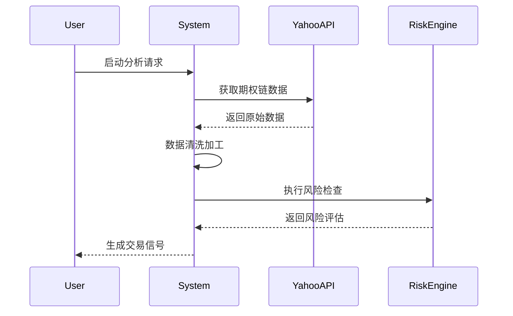

# 智能期权交易系统

## 系统架构设计


### 设计模式
1. **观察者模式** - 市场数据变动时自动通知策略引擎
2. **策略模式** - 不同交易策略可插拔替换
3. **工厂模式** - 期权合约对象的统一创建
4. **装饰器模式** - 风险控制规则的动态叠加

### 数据流
1. 数据层：Yahoo Finance/Polygon → DataLoader
2. 处理层：SignalGenerator + RiskManager
3. 输出层：Telegram通知/日志记录

### 核心模块
| 模块 | 职责 | 关键技术 |
|------|-----|---------|
| DataLoader | 实时数据采集 | yfinance, API轮询 |
| VolatilityEngine | 波动率分析 | GARCH模型, IV曲面拟合 | 
| GreekCalculator | 风险指标计算 | 自动微分, 数值逼近 |
| TelegramBot | 消息通知 | 异步IO, 消息队列 |

### 策略图
graph TD
    A[启动守护进程] --> B[轮询标的列表]
    B --> C{符合条件?}
    C -->|Yes| D[执行策略分析]
    D --> E[风险检查]
    E --> F[生成信号]
    F --> G[发送Telegram通知]
    C -->|No| H[等待下一周期]

## 部署指南

### 后台服务运行
```bash
# 复制系统服务文件
sudo cp systemd/option_trading.service /etc/systemd/system/

# 启动服务
sudo systemctl daemon-reload
sudo systemctl start option_trading
```

## 📦 安装指南
```bash
# 克隆仓库
git clone https://github.com/yourrepo/optionscheck.git
cd optionscheck

# 安装依赖
pip install -e .

# 初始化配置
cp config/config.yaml.example config/config.yaml
```

## ⚙️ 配置说明
编辑`config/config.yaml`：
```yaml
watchlist: ["SPY", "QQQ", "TSLA"]  # 监控标的
strategy:
  min_volume: 20                   # 最低成交量要求
  iv_threshold: 40                 # IV Rank阈值
  expiration_range: [25, 35]       # 目标到期日范围(天)
  risk:
    max_delta: 0.5                 # 最大Delta敞口
    max_theta: -0.1                # 最大Theta损失
```

## 🚀 使用示例
```bash
# 分析单个标的
python -m src.cli --ticker SPY --debug

# 监控观察列表
python -m src.cli --watchlist --interval 15
```

## 📊 数据流程图


## 🛠️ 开发指南
### 扩展新策略
1. 在`src/strategies/`下新建策略类
2. 实现核心方法：
```python
class MyStrategy(BaseStrategy):
    def generate_signal(self, data):
        # 实现策略逻辑
        return Signal(...)
```
3. 在`src/signal_generator.py`中注册策略

## 🔧 故障排查
常见问题：
1. **数据获取失败**
   - 检查网络连接
   - 验证API密钥配置
   - 查看`logs/error.log`

2. **策略无输出**
   - 检查标的流动性
   - 调整`min_volume`参数
   - 启用调试模式查看中间结果

## 🤝 贡献指南
欢迎通过以下方式参与贡献：
1. 提交Issue报告问题
2. 发起Pull Request改进代码
3. 完善文档翻译
4. 分享使用案例

## 📄 许可证
本项目采用 [MIT License](LICENSE)，可自由用于商业和个人用途。使用本系统产生的交易风险需自行承担。

---

> 📌 提示：建议交易前在模拟环境中充分测试策略，实际交易中请合理控制风险敞口。